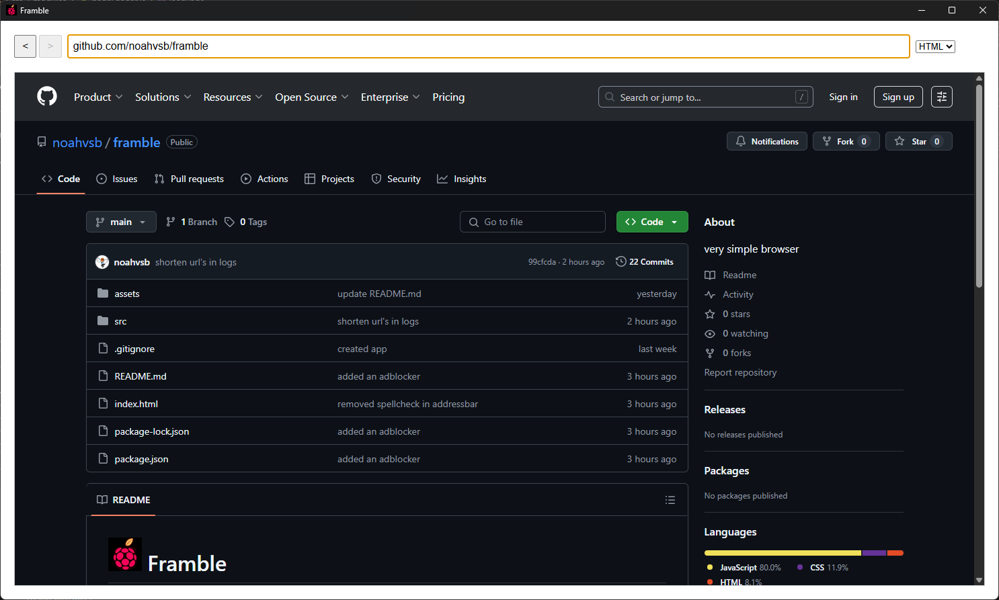
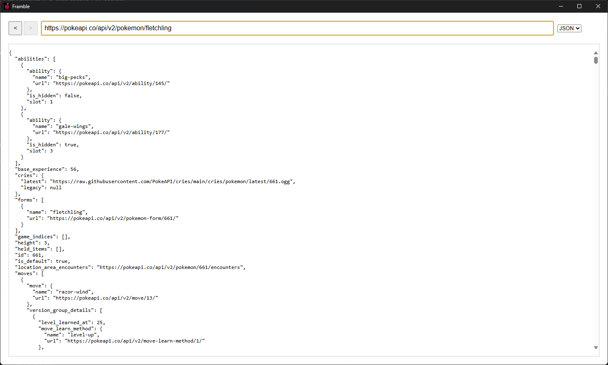

#  Framble 

A very simple browser, all in one tab. Content negotiation coming soon.

App built using HTML to render HTML using Electron.
Pretty stupid, but just a fun little project.

Due to security reasons some services aren't accessible, like google login.

Due to the limit of a single tab, some features won't work. Framble does however remove all `target="_blank"` attributes from `<a>`-elements to make sure those work.

## How to run

- Install modules with `npm install`
- Run using `npm start`

## Notes

- When running, you will see a message stating that 2 functions that are used are deprecated, this is due to the adblocker package I'm using. I made an [issue](https://github.com/ghostery/adblocker/issues/4981) in the corresponding github to address this. (Currently being fixed)