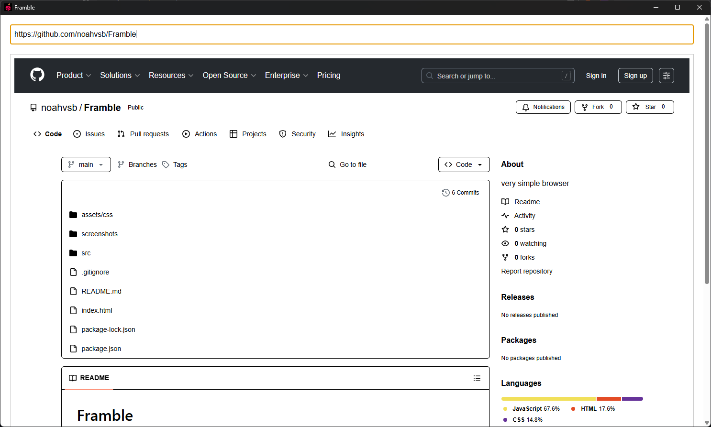

#  Framble 

Simple browser with less automation.

App built using HTML to render HTML.
Pretty stupid, but just a fun little project.

## How to run

- Install modules with `npm install`
- Run using `npm start`